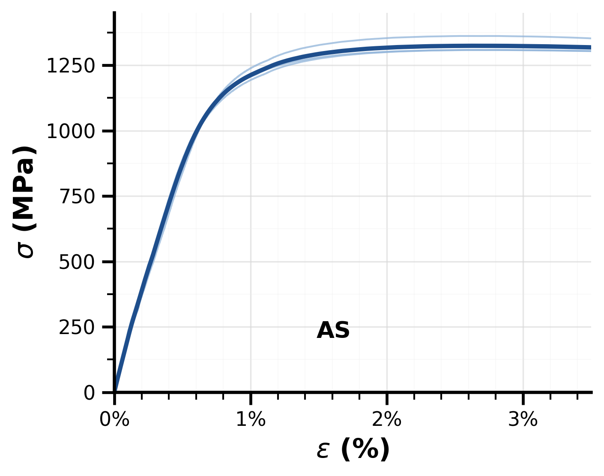
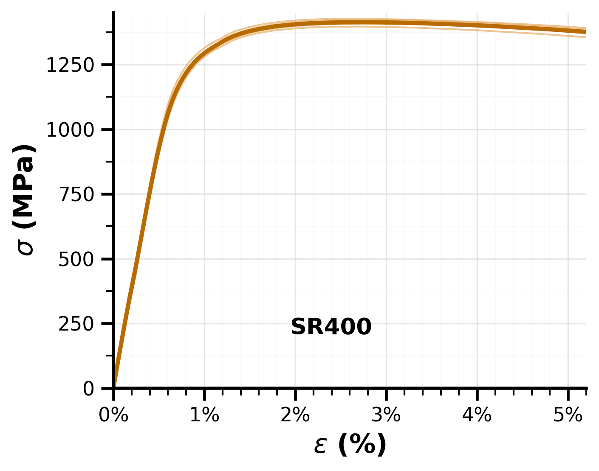
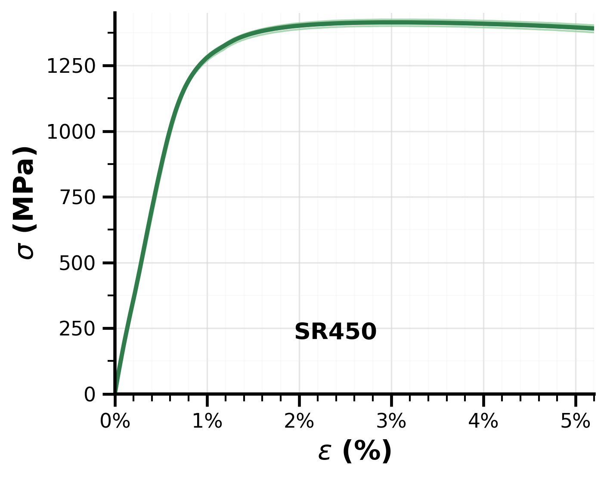
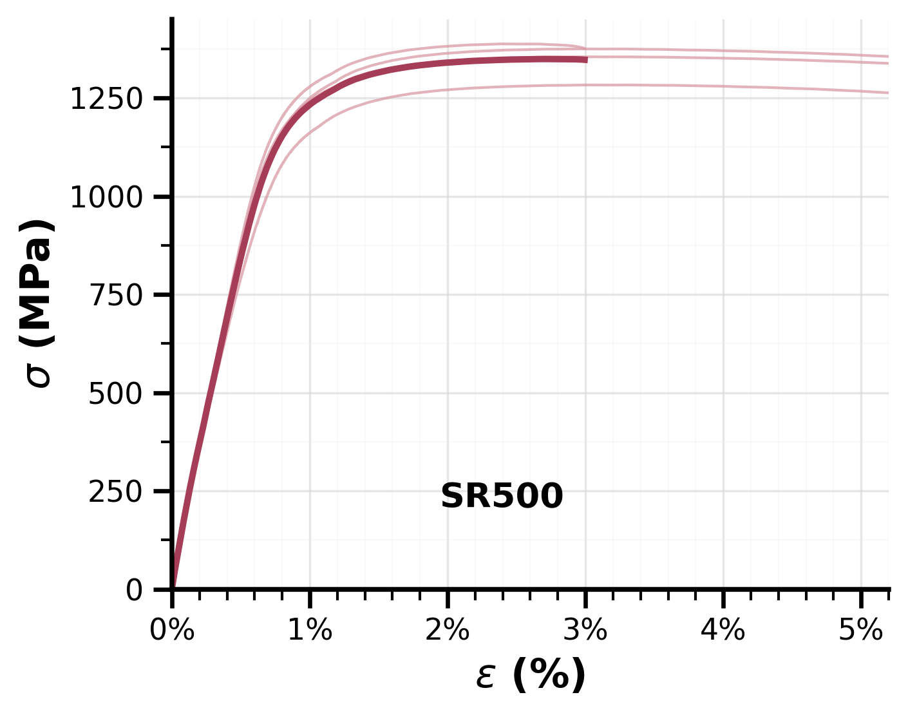
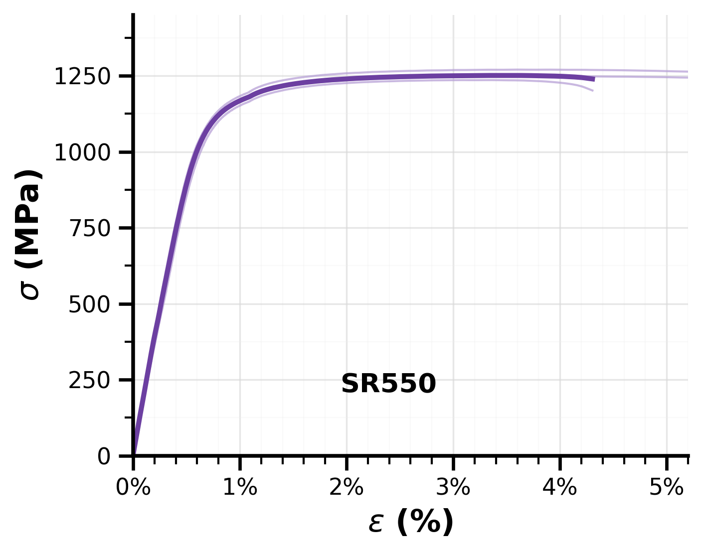
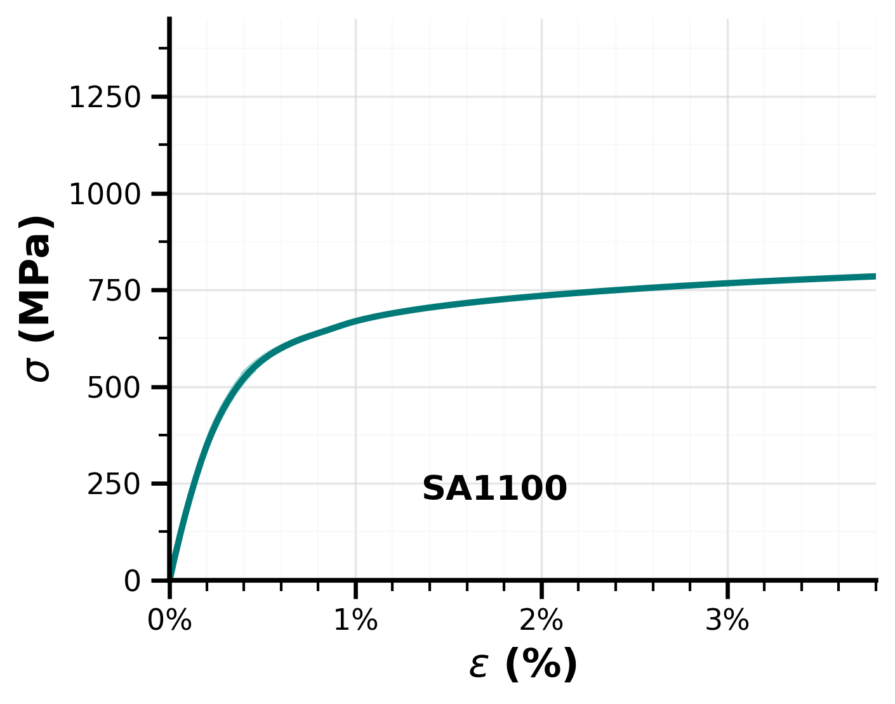

# LPBF 3 wt.% Ni-Modified SDSS 2507 Hardness and Tensile Results

This repository contains hardness and tensile-test analysis workflows, scripts, notebooks, and figures for laser powder bed fusion (LPBF)-fabricated 3 wt.% Ni-modified super duplex stainless steel 2507.

## Scope

The repository supports mechanical-property analysis of LPBF-fabricated 3 wt.% Ni-modified SDSS 2507, including Rockwell A hardness, Vickers microhardness, and tensile stress–strain response across the investigated processing and post-processing conditions.

The processing conditions included in the uploaded figures are:

- AS
- SR400
- SR450
- SR500
- SR550
- SA1100

## Repository structure

```text
lpbf-3ni-sdss-2507-hardness-tensile/
├── README.md
├── LICENSE
├── figures/
│   ├── AS_experimental_mean_styled.png
│   ├── SR400_experimental_mean_styled.png
│   ├── SR450_experimental_mean_styled.png
│   ├── SR500_experimental_mean_styled.png
│   ├── SR550_experimental_mean_styled.png
│   ├── SA1100_experimental_mean_styled.png
│   └── hardness_gradient_tolmuted.png
└── scripts/
    ├── Hardness.py
    ├── Hardness.ipynb
    ├── tensile.py
    └── tensile.ipynb
```

## Tensile analysis

The tensile workflow processes engineering stress–strain curves for each processing condition and generates styled mean stress–strain plots for LPBF-fabricated 3 wt.% Ni-modified SDSS 2507.

The script converts load to engineering stress using specimen cross-sectional area and converts engineering strain to percent strain for plotting.

## Hardness analysis

The hardness workflow summarizes Rockwell A hardness and Vickers microhardness measurements for LPBF-fabricated 3 wt.% Ni-modified SDSS 2507. The uploaded hardness figure compares surface and core/cross-section HRA values and HV0.1 values across the investigated processing conditions.

## Figures

### Tensile stress–strain curves













### Hardness summary


## Notes

- Mechanical-property values should be interpreted together with processing condition, phase balance, porosity/defect state, residual stress state, and post-processing history.
- Raw Excel/CSV input files are not included unless public release is intentional.
- The scripts may require local path adjustment before execution.
- Verify units, specimen geometry, and stress/strain conventions before reusing the workflows.

## Software

The workflows use:

- Python
- NumPy
- Pandas
- Matplotlib
- SciPy
- Jupyter Notebook

## License

This repository is licensed under the MIT License.
